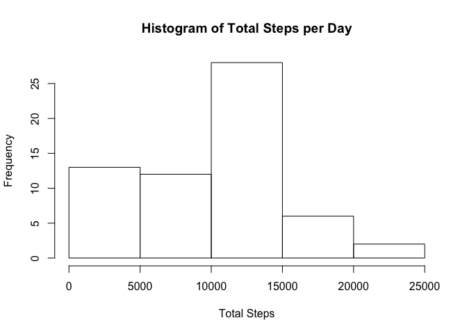
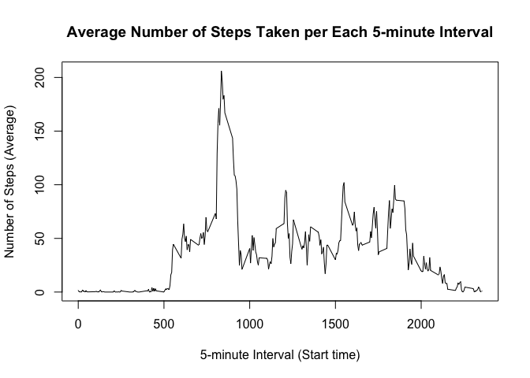
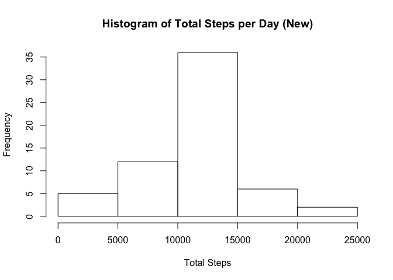
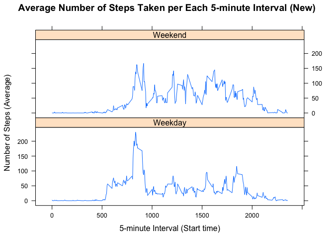

## Preparing the Environment

Ensuring the the envirnment is clear and calling libraries.


```r
##Clear environment
rm(list = ls())

##Call libraries
library(dplyr)
library(ggplot2)
library(lattice) 
library(lubridate)
```

## Loading and preprocessing the data

The code below is needed to:

* Load the data
* Process and format the data to conduct analysis 


```r
#Read-in zip file from working directory
con <- unzip("activity.zip")
df <- read.csv(con, stringsAsFactors = FALSE)
unlink(con); rm(con)

#Process the data, format dataframe column names, and format dates in preperation for analysis
df <- df %>%
   select(steps, interval, date) %>%
   mutate(Date = ymd(date)) %>%
   rename(Steps = steps, Interval = interval) %>% 
   select(Date, Steps, Interval)
```

## What is mean total number of steps taken per day?

The following code chunk was developed to:

* Display a histogram of the **total number of steps** taken **each day**.
* Calculates and reports the **mean** and **median** total number of steps taken per day.

**NOTE**: For this part of the analysis, missing values, e.g. NAs, are ignored.


```r
# Display a histogram of the total number of steps taken each day.
df2 <- df %>% 
   select(Steps, Date) %>% 
   group_by(Date) %>% 
   summarise(Total_Steps = sum(Steps, na.rm = TRUE))
hist(df2$Total_Steps, 
     main = "Histogram of Total Steps per Day",
     xlab = "Total Steps")
```

<!-- -->

```r
# Calculates and reports the mean and median total number of steps taken per day.
meanSPD <- mean(df2$Total_Steps, na.rm = TRUE)
meanSPD
```

```
## [1] 9354.23
```

```r
medianSPD <- median(df2$Total_Steps, na.rm = TRUE)
medianSPD
```

```
## [1] 10395
```

For this sample, the **mean** (average) is *9354.23 steps per day* and the **median** is *10395 steps per day*.

## What is the average daily activity pattern?

The following code chunk sets out to solve the following objectives:

* Make a time series plot of the 5-minute interval and the average number of steps taken, averaged across all days.
* Which 5-minute interval, on average across all the days in the dataset, contains the maximum number of steps?

**NOTE**: For this part of the analysis, missing values, e.g. NAs, are ignored.


```r
rm(df2, meanSPD, medianSPD)
# Create time series plot of the 5-minute interval (x-axis) and the average number of steps taken, averaged across all days (y-axis).
df3 <- df %>% 
   select(Steps, Interval) %>% 
   group_by(Interval) %>% 
   summarize(Avg_Steps = mean(Steps, na.rm = TRUE))
plot(x = df3$Interval, 
     y = df3$Avg_Steps, 
     type = "l",
     main = "Average Number of Steps Taken per Each 5-minute Interval",
     xlab = "5-minute Interval (Start time)",
     ylab = "Number of Steps (Average)")
```

<!-- -->

```r
# Determine 5-minute interval, on average across all the days in the dataset, containing the maximum number of steps.
maxInt <- df3$Interval[df3$Avg_Steps == max(df3$Avg_Steps)]
maxInt
```

```
## [1] 835
```

```r
maxSPI <- df3$Avg_Steps[df3$Avg_Steps == max(df3$Avg_Steps)]
maxSPI
```

```
## [1] 206.1698
```
For this sample, *835* is the start of the 5-minute interval with the highest average steps per 5-minute interval.  The highest interval average is *206.17 steps per 5-minute interval*.

## Imputing missing values

There are a number of days/intervals where there are missing values (coded as `NA`). The presence of missing days may introduce bias into some calculations or summaries of the data.

To address these potential issues, the following objectives are addressed:

* Calculate and report the total number of missing values in the dataset (i.e. the total number of rows with `NA`s)
* Task: Devise a strategy for filling in all of the missing values in the dataset. Approach: The mean for the specific 5-minute interval is used to fill in the missing value.  If all values are missing for the 5-minute interval, then a value of 0 is used.
* A 'new' dataset is created from the original dataset with the missing data filled in using the approach described above.
* Make a histogram of the total number of steps taken each day with the 'new' dataset.
   + Calculate and report the **mean** and **median** total number of steps taken per day. 
   + Do these values differ from the estimates from the first part of the assignment? 
   + What is the impact of imputing missing data on the estimates of the total daily number of steps?


```r
rm(maxInt, maxSPI)
# Calculate and report the total number of missing values in the dataset (i.e. the total number of rows with `NA`s)
summary(df)
```

```
##       Date                Steps           Interval     
##  Min.   :2012-10-01   Min.   :  0.00   Min.   :   0.0  
##  1st Qu.:2012-10-16   1st Qu.:  0.00   1st Qu.: 588.8  
##  Median :2012-10-31   Median :  0.00   Median :1177.5  
##  Mean   :2012-10-31   Mean   : 37.38   Mean   :1177.5  
##  3rd Qu.:2012-11-15   3rd Qu.: 12.00   3rd Qu.:1766.2  
##  Max.   :2012-11-30   Max.   :806.00   Max.   :2355.0  
##                       NA's   :2304
```

```r
MissingValues <- sum(is.na(df$Steps))
MissingValues
```

```
## [1] 2304
```

```r
# Task: Devise a strategy for filling in all of the missing values in the dataset. Approach: The mean for the specific 5-minute interval is used to fill in the missing value.  If all values are missing for the 5-minute interval, then a value of 0 is used.
# A 'new' dataset is created from the original dataset with the missing data filled in using the approach described above.
#Create an imputed data frame
dfNew <- df
#Find the NA values and sub in the interval average for the NA value
for (i in 1:length(dfNew$Steps)) {
   if (is.na(dfNew$Steps[i])) {
      dfNew$Steps[i] <- df3$Avg_Steps[dfNew$Interval[i] == df3$Interval]
   } #/ if
} #/ for i

# Make a histogram of the total number of steps taken each day with the 'new' dataset.
df4 <- dfNew %>% 
   select(Steps, Date) %>% 
   group_by(Date) %>% 
   summarise(Total_Steps = sum(Steps, na.rm = TRUE))
hist(df4$Total_Steps, 
     main = "Histogram of Total Steps per Day (New)",
     xlab = "Total Steps")
```

<!-- -->

```r
# Calculates and reports the mean and median total number of steps taken per day.
meanSPD <- mean(df4$Total_Steps, na.rm = TRUE)
meanSPD
```

```
## [1] 10766.19
```

```r
medianSPD <- median(df4$Total_Steps, na.rm = TRUE)
medianSPD
```

```
## [1] 10766.19
```

```r
   # Do these values differ from the estimates from the first part of the assignment? 
   # What is the impact of imputing missing data on the estimates of the total daily number of steps?
```

* From the summary of the original data, the missing values are located within the *steps* variable.  Further evaluation of the *steps* variable shows that there are a total of **2304 missing values** in the original data. 
* For this 'new' sample, the **mean** (average) is *1.076619\times 10^{4} steps per day* and the **median** is *1.0766189\times 10^{4} steps per day*. 
   + Question: Do these values differ from the estimates from the first part of the assignment? Response: Yes, using the established imputed value rules increases the mean and median steps per day. 
   + Question: What is the impact of imputing missing data on the estimates of the total daily number of steps? Response: There is an overall increase in the mean and median values for steps per day.  Further, when observing the histogram, the left skew from the original data is now more centralized.  Although the mean and medians for the imuted data increased and the imputed mean and median converged to the same value, further statistical analysis is required to determine if there is significant difference between these values.

## Are there differences in activity patterns between weekdays and weekends?

Using the dataset with the filled-in missing values, e.g. 'new' data set, the factor variable is added to differentiate between weekdays and weekend days. In order to achieve this:

* Create a new factor variable in the dataset with two levels -- "weekday" and "weekend" indicating whether a given date is a weekday or weekend day.
* Make a panel plot containing a time series plot (i.e. `type = "l"`) of the 5-minute interval (x-axis) and the average number of steps taken, averaged across all weekday days or weekend days (y-axis).


```r
rm(df3, df4, meanSPD, medianSPD, MissingValues, i)

# Create a new factor variable in the dataset with two levels -- "weekday" and "weekend" indicating whether a given date is a weekday or weekend day.
dfNew$Day_Type[!(weekdays(dfNew$Date) %in% c("Saturday", "Sunday"))] <- "Weekday"
dfNew$Day_Type[weekdays(dfNew$Date) %in% c("Saturday", "Sunday")] <- "Weekend"
dfNew$Day_Type <- factor(dfNew$Day_Type,
                         levels=c("Weekday", "Weekend"),
                         labels=c("Weekday", "Weekend"))

# Make a panel plot containing a time series plot (i.e. `type = "l"`) of the 5-minute interval (x-axis) and the average number of steps taken, averaged across all weekday days or weekend days (y-axis).
df5 <- dfNew %>% 
   select(Steps, Day_Type, Interval) %>% 
   group_by(Day_Type, Interval) %>% 
   summarise(Avg_Steps = mean(Steps))

# Plot by weekday (factor level)
xyplot(df5$Avg_Steps~df5$Interval|df5$Day_Type, 
     type = "l",
     main = "Average Number of Steps Taken per Each 5-minute Interval (New)",
     xlab = "5-minute Interval (Start time)",
     ylab = "Number of Steps (Average)",
     layout=c(1,2))
```

<!-- -->
